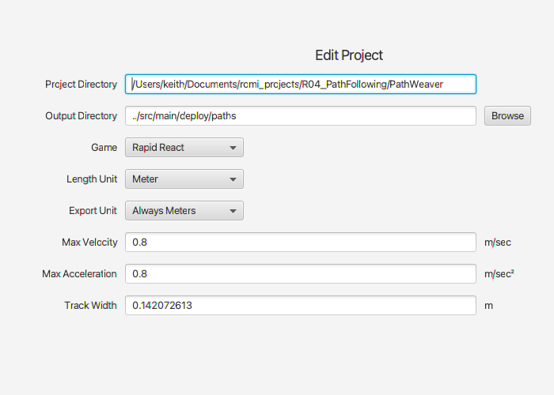
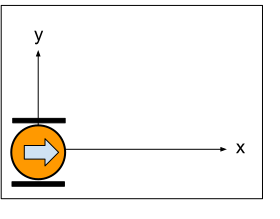

# Path Following

This project experiments with the RamseteCommand.

## PathWeaver setup

For this project, note the locations of the `PathWeaver` directory and the output directory.




## Waypoints

When calculating waypoints, the X coordinate is in the direction that the robot is initially facing, while the Y coordinate increases from the left of the robot.



Here's an example:
The first waypoint will be 0.6 meters forward and 0.3 meters to the right (about 2 feet forward and 1 foot right).  The second waypoint will be 1 meter forward of the starting point.  The third waypoint will be heading back towards the starting point but to the right of the start.  The ending point should be even with the starting point but 0.3 meters to the left.
```java
   autonomousCommand = new ChassisWaypointCommand(
      new Pose2d(0, 0, new Rotation2d(0)),
      List.of(
        new Translation2d(0.6, -0.3),
        new Translation2d(1.0, 0.0),
        new Translation2d(0.6, 0.3),
        new Translation2d(0.1, 0.3)
      ),
      new Pose2d(0.0, 0.3, new Rotation2d(180)),
      chassis);
```